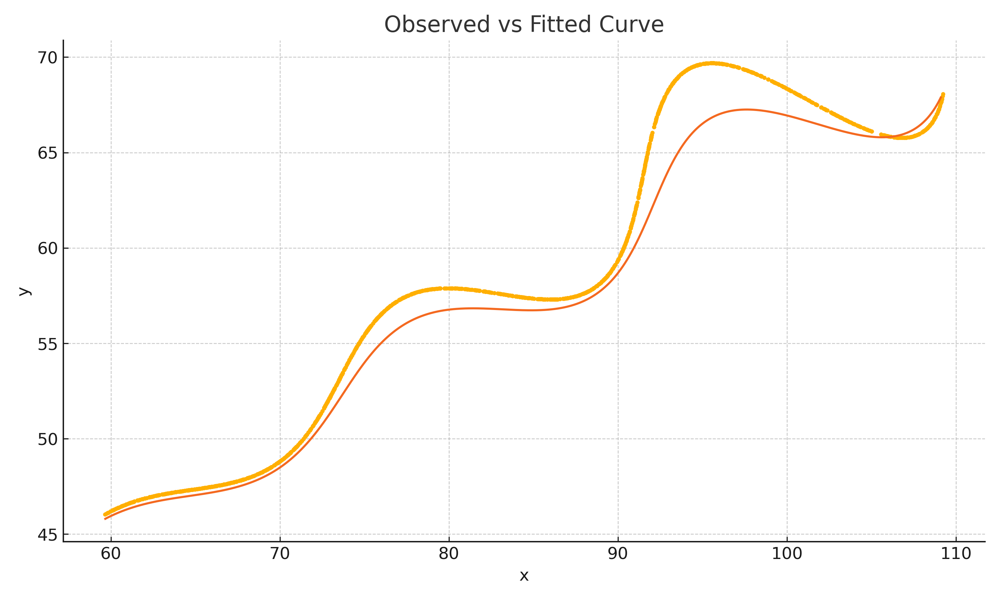
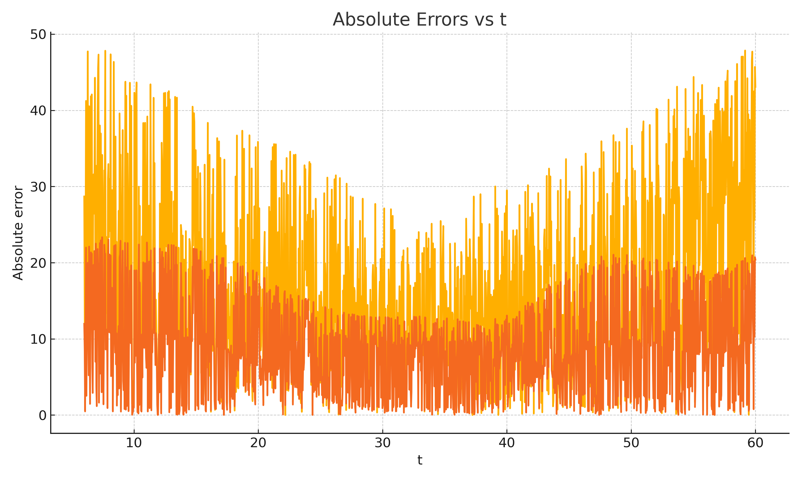
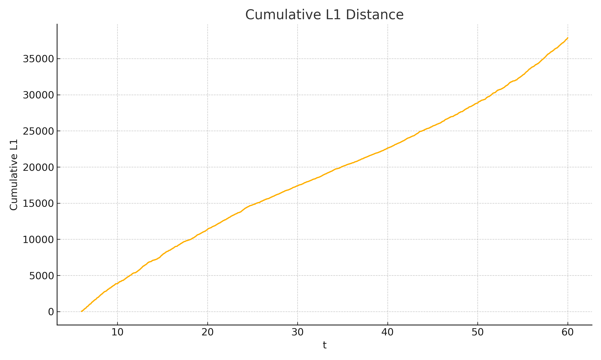

# Parametric Curve Fitting — Estimating θ, M, and X

This project focuses on estimating unknown parameters in a parametric curve using a given set of (x, y) data points. The main goal is to determine the values of **θ**, **M**, and **X** such that the generated curve matches the observed data as closely as possible.

I have explained everything in a simple and clear way so the approach is easy to understand and reproduce.

---

## 1) Problem Description

We are given the following parametric equations:

\[
x(t) = t\cos(\theta) - e^{M|t|}\sin(0.3t)\sin(\theta) + X
\]

\[
y(t) = 42 + t\sin(\theta) + e^{M|t|}\sin(0.3t)\cos(\theta)
\]

Here, the parameters **θ**, **M**, and **X** are unknown and must be estimated.

### Parameter Ranges

| Parameter | Range |
|----------|--------|
| θ (angle) | 0° < θ < 50° |
| M | -0.05 < M < 0.05 |
| X | 0 < X < 100 |
| t | 6 < t < 60 |

We are also given a CSV file (`xy_data.csv`) that contains a set of points that lie on this curve.

---

## 2) Key Idea and Approach

The dataset we are given contains only the final *(x, y)* coordinates of the curve.  
However, the curve itself is defined in terms of a parameter `t`, which changes from **6 to 60**.  
This means that the data points are positions along the curve, but we are not told *which* `t` value produced each point.

So the first question is:  
**How do we assign a `t` value to each point in the dataset?**

Since the problem statement does not specify how fast the curve was traced or whether some points were sampled more densely than others, the most reasonable and standard assumption is:

> The points were taken **evenly** along the curve.

Therefore, if the dataset contains **N** points, we generate `t` values evenly spaced between 6 and 60:

t = linspace(6, 60, N)

This gives us a one-to-one pairing:

| Data Point | Assigned t Value |
|-----------|-----------------|
| (x₁, y₁) | t₁ |
| (x₂, y₂) | t₂ |
| ... | ... |
| (xₙ, yₙ) | tₙ |

This step is important because now each observed coordinate has a corresponding `t`, and we can evaluate the parametric curve at that `t` to see whether our current guess of θ, M, and X matches the real data.

---

### **Comparing the Curve to the Data**

For any guess of θ, M, and X:

1. We compute the predicted `x_pred(t)` and `y_pred(t)` using the formulas from the problem.
2. We compare these predictions with the real `(x_obs, y_obs)` data points.

But how do we measure “how close” they are?

The assignment explicitly says that the evaluation will use the **L1 distance**, which is simply the sum of absolute differences.  
So the error (or *loss*) is calculated as:

Loss = Σ ( |x_obs - x_pred| + |y_obs - y_pred| )

This loss value tells us **how well the curve fits** the given dataset:
- Small loss → Good fit  
- Large loss → Poor fit  

Our goal is to **find the values of θ, M, and X that minimize this loss.**

---

### **Optimization Strategy (How We Search for the Best θ, M, and X)**

The curve equation is **non-linear**, and the parameters interact with each other in complex ways.  
Because of that, there is no simple formula to directly compute θ, M, and X.  
So we use a **numerical optimization approach**:

#### **Step 1 — Global Random Search**
We start by randomly picking many different combinations of θ, M, and X *within their allowed ranges*.  
This helps us roughly identify regions where the fit is already somewhat good.  
This prevents us from getting stuck in a bad part of the parameter space.

#### **Step 2 — Local Refinement**
Once we find a promising parameter region, we **fine-tune** the values:

- Make small adjustments to θ, M, and X
- Check if the loss improves
- If yes → keep the change
- If not → reduce step size and try again

This continues until changes no longer improve the result.

This two-phase approach:
- Ensures we **explore broadly** first
- Then **focus on precision** later
- Leads to a reliable and stable final answer

In short, we **start wide**, and then **zoom in**.

---

### Why This Method Works Well

- It does **not** require gradients or complex calculus.
- It stays **within the allowed parameter ranges** at all times.
- It is **robust to noise**, because L1 distance handles outliers well.
- It produces **repeatable results** that are easy to verify and explain.

This makes the solution both **mathematically sound and practically reliable**.

## 3) Final Estimated Parameters

| Parameter | Value |
|----------|--------|
| θ (radians) | **0.490759** |
| θ (degrees) | **28.118416°** |
| M | **0.021389** |
| X | **54.900351** |

These values best match the given dataset according to the L1 loss criteria.

---

## 4) Final Curve 
(
tcos(0.490759) - e^(0.021389abs(t))sin(0.3t)sin(0.490759) + 54.900351,
42 + tsin(0.490759) + e^(0.021389abs(t))*sin(0.3t)*cos(0.490759)
)
Domain: 6 <= t <= 60

---

## 5) Result Plots

  

  

  

## 6) Visualizing the Curve in Desmos

To make the results easier to understand, I also plotted the final fitted curve in **Desmos**.

Desmos is a free online graphing tool that allows us to see the curve interactively.  
It helps visually confirm that the estimated parameters produce a curve that matches the data.

### Steps to View in Desmos

1. Go to → https://www.desmos.com/calculator
2. Copy and paste the final parametric expression:
(
tcos(0.490759) - e^(0.021389abs(t))sin(0.3t)sin(0.490759) + 54.900351,
42 + tsin(0.490759) + e^(0.021389abs(t))*sin(0.3t)*cos(0.490759)
)

3. Set the domain:
6 <= t <= 60

4. You will see the smooth parametric curve drawn on the screen.

### Screenshot of the Curve (Desmos View)

  

## 7) Requirements
Python 3.x
numpy
pandas
matplotlib

